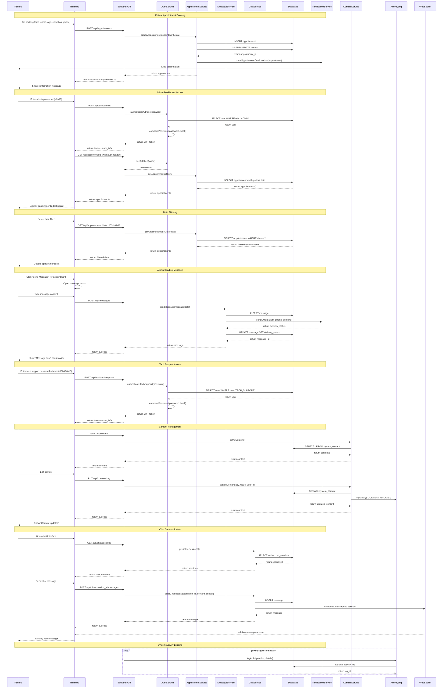

# تصميم النظام - تطبيق إدارة عيادة الدكتور مصطفى اليوسف

## Implementation approach

سنقوم بتطوير تطبيق ويب شامل لإدارة العيادة باستخدام تقنيات حديثة ومكتبات مفتوحة المصدر. النهج المتبع يركز على:

### التحديات التقنية الرئيسية:
1. **الأمان والخصوصية**: حماية البيانات الطبية الحساسة
2. **المصادقة متعددة المستويات**: نظام دخول مختلف للإدارة والدعم الفني
3. **التواصل الفوري**: نظام رسائل ودردشة في الوقت الفعلي
4. **إدارة المواعيد المعقدة**: فلترة وتنظيم المواعيد بكفاءة

### الإطار التقني المختار:
- **Frontend**: React.js مع TypeScript لضمان type safety
- **UI Framework**: Shadcn-ui مع Tailwind CSS للتصميم المتجاوب
- **Backend**: Node.js مع Express.js للأداء العالي
- **Database**: PostgreSQL لقاعدة البيانات الرئيسية مع Redis للتخزين المؤقت
- **Real-time Communication**: Socket.io للرسائل الفورية
- **Authentication**: JWT مع bcrypt للتشفير
- **Validation**: Zod للتحقق من صحة البيانات
- **State Management**: Zustand لإدارة الحالة
- **Date Management**: date-fns للتعامل مع التواريخ

### مبادئ التصميم:
1. **Security First**: تشفير شامل وحماية متعددة الطبقات
2. **User Experience**: واجهة بسيطة وسهلة الاستخدام
3. **Scalability**: قابلية التوسع لدعم نمو العيادة
4. **Maintainability**: كود منظم وقابل للصيانة

## Data structures and interfaces

```mermaid
classDiagram
    class User {
        +id: string
        +username: string
        +password_hash: string
        +role: UserRole
        +created_at: Date
        +last_login: Date
        +is_active: boolean
        +login(password: string) Promise~AuthResult~
        +logout() void
        +validatePassword(password: string) boolean
    }

    class Patient {
        +id: string
        +name: string
        +age: number
        +phone: string
        +condition: string
        +created_at: Date
        +updated_at: Date
        +validatePhone() boolean
        +validateAge() boolean
        +getFullInfo() PatientInfo
    }

    class Appointment {
        +id: string
        +patient_id: string
        +appointment_date: Date
        +appointment_time: string
        +status: AppointmentStatus
        +notes: string
        +created_at: Date
        +updated_at: Date
        +cancel() void
        +reschedule(new_date: Date, new_time: string) void
        +confirm() void
        +getPatientInfo() Patient
    }

    class Message {
        +id: string
        +sender_id: string
        +recipient_id: string
        +content: string
        +message_type: MessageType
        +appointment_id: string
        +is_read: boolean
        +sent_at: Date
        +markAsRead() void
        +getMessageThread() Message[]
    }

    class ChatSession {
        +id: string
        +patient_phone: string
        +is_active: boolean
        +created_at: Date
        +last_message_at: Date
        +messages: Message[]
        +sendMessage(content: string, sender: string) Message
        +closeSession() void
        +getMessageHistory() Message[]
    }

    class SystemContent {
        +id: string
        +content_key: string
        +content_value: string
        +content_type: ContentType
        +updated_by: string
        +updated_at: Date
        +updateContent(new_value: string, user_id: string) void
        +getContent(key: string) string
    }

    class ActivityLog {
        +id: string
        +user_id: string
        +action: string
        +resource_type: string
        +resource_id: string
        +details: string
        +ip_address: string
        +timestamp: Date
        +logActivity(action: string, details: string) void
        +getLogsByUser(user_id: string) ActivityLog[]
    }

    class AuthService {
        +generateToken(user: User) string
        +verifyToken(token: string) User
        +hashPassword(password: string) string
        +comparePassword(password: string, hash: string) boolean
        +authenticateAdmin(password: string) AuthResult
        +authenticateTechSupport(password: string) AuthResult
    }

    class AppointmentService {
        +createAppointment(data: AppointmentData) Appointment
        +getAppointments(filters: AppointmentFilters) Appointment[]
        +getAppointmentsByDate(date: Date) Appointment[]
        +updateAppointment(id: string, data: Partial~AppointmentData~) Appointment
        +cancelAppointment(id: string) void
        +getAvailableSlots(date: Date) string[]
    }

    class MessageService {
        +sendMessage(data: MessageData) Message
        +getMessages(filters: MessageFilters) Message[]
        +markAsRead(message_id: string) void
        +sendAppointmentReminder(appointment_id: string) Message
        +broadcastMessage(content: string) Message[]
    }

    class ChatService {
        +createChatSession(patient_phone: string) ChatSession
        +getChatSession(session_id: string) ChatSession
        +sendChatMessage(session_id: string, content: string, sender: string) Message
        +getActiveSessions() ChatSession[]
        +closeChatSession(session_id: string) void
    }

    class ContentService {
        +getContent(key: string) string
        +updateContent(key: string, value: string, user_id: string) SystemContent
        +getAllContent() SystemContent[]
        +getContentHistory(key: string) SystemContent[]
    }

    class NotificationService {
        +sendSMS(phone: string, message: string) boolean
        +sendAppointmentConfirmation(appointment: Appointment) void
        +sendAppointmentReminder(appointment: Appointment) void
        +notifyAppointmentChange(appointment: Appointment) void
    }

    %% Enums
    class UserRole {
        <<enumeration>>
        ADMIN
        TECH_SUPPORT
        PATIENT
    }

    class AppointmentStatus {
        <<enumeration>>
        PENDING
        CONFIRMED
        CANCELLED
        COMPLETED
        NO_SHOW
    }

    class MessageType {
        <<enumeration>>
        APPOINTMENT_CONFIRMATION
        APPOINTMENT_REMINDER
        HEALTH_GUIDANCE
        GENERAL_MESSAGE
        CHAT_MESSAGE
    }

    class ContentType {
        <<enumeration>>
        TEXT
        HTML
        CONFIGURATION
        TEMPLATE
    }

    %% Relationships
    Patient ||--o{ Appointment : has
    Appointment ||--o{ Message : generates
    User ||--o{ ActivityLog : creates
    User ||--o{ Message : sends
    ChatSession ||--o{ Message : contains
    SystemContent ||--o{ ActivityLog : tracks_changes

    %% Service Dependencies
    AuthService ..> User : authenticates
    AppointmentService ..> Appointment : manages
    AppointmentService ..> Patient : uses
    MessageService ..> Message : handles
    MessageService ..> Appointment : references
    ChatService ..> ChatSession : manages
    ChatService ..> Message : creates
    ContentService ..> SystemContent : manages
    NotificationService ..> Appointment : notifies
    NotificationService ..> Patient : contacts
```

## Program call flow



## Anything UNCLEAR

بعد مراجعة المتطلبات، هناك بعض النقاط التي تحتاج توضيح:

### 1. تفاصيل نظام المواعيد
- **ساعات العمل**: ما هي ساعات العمل المحددة للعيادة؟
- **مدة الموعد**: كم هي المدة المخصصة لكل موعد؟
- **الحد الأقصى**: ما هو العدد الأقصى للمواعيد اليومية؟
- **أيام العطل**: هل هناك أيام عطل أو إجازات محددة؟

### 2. نظام الرسائل والإشعارات
- **SMS Integration**: هل مطلوب تكامل مع خدمة SMS فعلية أم محاكاة؟
- **تكلفة الرسائل**: ما هي الميزانية المخصصة لإرسال الرسائل؟
- **أنواع الإشعارات**: هل مطلوب إشعارات تلقائية (تذكيرات قبل الموعد بـ 24 ساعة مثلاً)؟

### 3. إدارة البيانات
- **النسخ الاحتياطي**: ما هي استراتيجية النسخ الاحتياطي المطلوبة؟
- **الاحتفاظ بالبيانات**: كم المدة المطلوبة للاحتفاظ ببيانات المرضى؟
- **الخصوصية**: هل هناك متطلبات قانونية محددة للخصوصية؟

### 4. التوسعات المستقبلية
- **أطباء متعددين**: هل سيتم دعم أكثر من طبيب في المستقبل؟
- **فروع متعددة**: هل هناك خطط لفتح فروع أخرى للعيادة؟
- **تطبيق جوال**: هل مطلوب تطوير تطبيق جوال منفصل؟

### 5. التكامل مع الأنظمة الخارجية
- **أنظمة الدفع**: هل مطلوب تكامل مع بوابات الدفع الإلكتروني؟
- **التقويم**: هل مطلوب تكامل مع Google Calendar أو Outlook؟
- **الملفات الطبية**: هل مطلوب نظام لحفظ الملفات الطبية والصور؟

هذه النقاط ستساعد في تحسين التصميم وضمان تلبية جميع الاحتياجات بدقة.