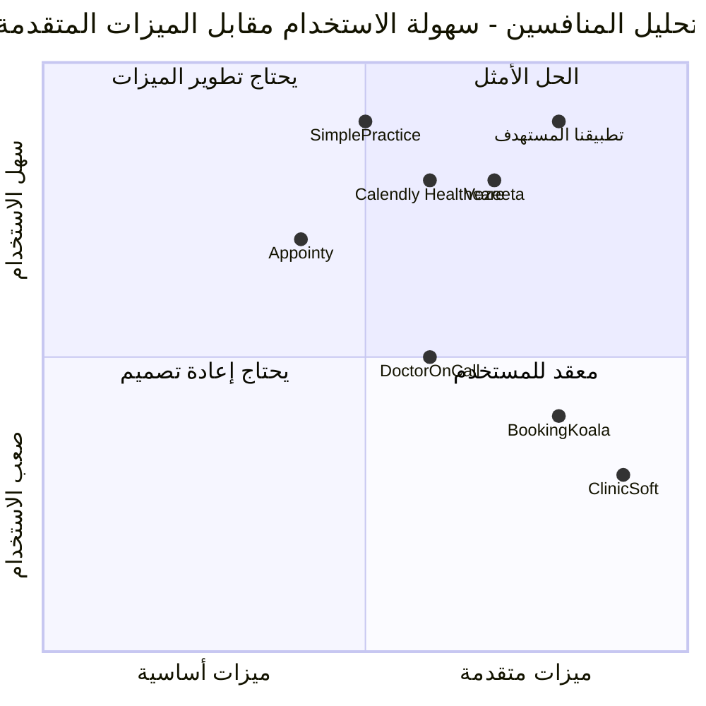

# وثيقة متطلبات المنتج (PRD)
## تطبيق إدارة عيادة الدكتور مصطفى اليوسف

### معلومات المشروع الأساسية
- **اللغة**: العربية
- **لغة البرمجة**: TypeScript, Shadcn-ui, Tailwind CSS
- **اسم المشروع**: dr_mustafa_clinic_app
- **المتطلبات الأصلية**: تطبيق إدارة عيادة شامل يتضمن نظام حجوزات، لوحة إدارية، لوحة دعم فني، ونظام دردشة

---

## 1. تعريف المنتج

### 1.1 أهداف المنتج
1. **تحسين كفاءة العمليات الإدارية**: تقليل الوقت المطلوب لإدارة المواعيد والمرضى بنسبة 60%
2. **تعزيز تجربة المريض**: توفير نظام حجز سهل ومرن مع إمكانية التواصل المباشر مع العيادة
3. **ضمان الأمان والخصوصية**: حماية بيانات المرضى وفقاً لمعايير الأمان الطبي

### 1.2 قصص المستخدمين
1. **كمريض، أريد حجز موعد بسهولة** حتى أتمكن من تحديد الوقت المناسب لي دون الحاجة للاتصال
2. **كطبيب، أريد رؤية جميع المواعيد في مكان واحد** حتى أتمكن من تنظيم يومي بكفاءة
3. **كإداري، أريد إرسال تذكيرات للمرضى** حتى أقلل من نسبة عدم الحضور
4. **كمدير تقني، أريد تعديل النصوص والإعدادات** حتى أحافظ على تحديث النظام
5. **كمريض، أريد التواصل مع العيادة** حتى أحصل على الإرشادات الصحية والتأكيدات

### 1.3 التحليل التنافسي

#### المنافسون الرئيسيون:
1. **Vezeeta (ڤيزيتا)**
   - المزايا: واجهة سهلة، انتشار واسع، تطبيق جوال
   - العيوب: رسوم عالية، تعقيد في الإعدادات

2. **DoctorOnCall**
   - المزايا: دعم الاستشارات عن بُعد، نظام دفع متكامل
   - العيوب: محدود في التخصيص، واجهة معقدة

3. **ClinicSoft**
   - المزايا: نظام إدارة شامل، تقارير مفصلة
   - العيوب: تكلفة عالية، يتطلب تدريب مكثف

4. **SimplePractice**
   - المزايا: سهولة الاستخدام، دعم فني جيد
   - العيوب: محدود في اللغة العربية، رسوم شهرية

5. **Appointy**
   - المزايا: مجاني للاستخدام الأساسي، تكامل مع التقويم
   - العيوب: ميزات محدودة، لا يدعم العربية بشكل كامل

6. **Calendly Healthcare**
   - المزايا: تكامل ممتاز مع التقويمات، واجهة نظيفة
   - العيوب: لا يدعم العربية، محدود في إدارة البيانات الطبية

7. **BookingKoala**
   - المزايا: تخصيص عالي، دعم متعدد اللغات
   - العيوب: واجهة معقدة، تكلفة متوسطة

### 1.4 مخطط المقارنة التنافسية

---

## 2. المواصفات التقنية

### 2.1 تحليل المتطلبات
يهدف التطبيق إلى توفير حل شامل لإدارة عيادة طبية يجمع بين سهولة الاستخدام والوظائف المتقدمة. النظام يجب أن يدعم العمليات اليومية للعيادة من حجز المواعيد إلى إدارة التواصل مع المرضى، مع ضمان الأمان والخصوصية.

### 2.2 مجموعة المتطلبات

#### المتطلبات الأساسية (P0)
- **REQ-001**: نظام حجز المواعيد مع الحقول المطلوبة (الاسم، العمر، الحالة، رقم الهاتف)
- **REQ-002**: لوحة إدارية محمية بكلمة مرور (a0988)
- **REQ-003**: عرض جميع المواعيد مع إمكانية الفلترة حسب التاريخ
- **REQ-004**: نظام إرسال الرسائل للمرضى
- **REQ-005**: لوحة دعم فني محمية بكلمة مرور (ahmed0988634015)
- **REQ-006**: نظام دردشة للتواصل مع العيادة

#### المتطلبات المهمة (P1)
- **REQ-007**: واجهة مستخدم متجاوبة تدعم الأجهزة المحمولة
- **REQ-008**: نظام تنبيهات وتذكيرات
- **REQ-009**: تشفير البيانات الحساسة
- **REQ-010**: نظام نسخ احتياطي للبيانات
- **REQ-011**: تسجيل العمليات (Activity Logs)

#### المتطلبات المرغوبة (P2)
- **REQ-012**: تكامل مع التقويم
- **REQ-013**: تقارير وإحصائيات
- **REQ-014**: نظام تقييم الخدمة
- **REQ-015**: دعم متعدد اللغات (عربي/إنجليزي)

### 2.3 مسودة تصميم واجهة المستخدم

#### الصفحة الرئيسية
- شعار العيادة ومعلومات الاتصال
- نموذج حجز الموعد
- معلومات عن الطبيب والخدمات

#### لوحة الإدارة
- جدول المواعيد مع أدوات الفلترة
- إحصائيات سريعة (عدد المواعيد اليومية/الأسبوعية)
- أدوات إرسال الرسائل

#### لوحة الدعم الفني
- محرر النصوص
- إعدادات النظام
- إدارة المستخدمين

#### نظام الدردشة
- واجهة دردشة بسيطة
- عرض الرسائل الواردة والصادرة
- إمكانية إرفاق الملفات

### 2.4 الأسئلة المفتوحة
1. هل يحتاج النظام لتكامل مع أنظمة دفع إلكترونية؟
2. ما هي ساعات العمل المطلوب دعمها في نظام الحجز؟
3. هل هناك حاجة لنظام تذكيرات تلقائية عبر SMS؟
4. ما هو الحد الأقصى لعدد المواعيد اليومية؟
5. هل يحتاج النظام لدعم أكثر من طبيب واحد؟

---

## 3. المتطلبات الوظيفية التفصيلية

### 3.1 نظام حجز المواعيد
**الوصف**: يسمح للمرضى بحجز المواعيد عبر الإنترنت
**المدخلات**: الاسم، العمر، الحالة المرضية، رقم الهاتف
**المخرجات**: تأكيد الحجز، رقم المرجع
**قواعد العمل**: 
- يجب التحقق من صحة رقم الهاتف
- لا يمكن حجز أكثر من موعد واحد في نفس الوقت
- يجب أن يكون العمر رقماً صحيحاً

### 3.2 اللوحة الإدارية
**الوصف**: واجهة لإدارة المواعيد والتواصل مع المرضى
**المتطلبات الأمنية**: كلمة مرور (a0988)
**الوظائف**:
- عرض جميع المواعيد
- فلترة حسب التاريخ
- إرسال رسائل للمرضى
- تعديل أو إلغاء المواعيد

### 3.3 لوحة الدعم الفني
**الوصف**: أدوات إدارة النظام والمحتوى
**المتطلبات الأمنية**: كلمة مرور (ahmed0988634015)
**الوظائف**:
- تعديل النصوص والمحتوى
- إدارة إعدادات النظام
- عرض سجلات النشاط

### 3.4 نظام الدردشة
**الوصف**: منصة تواصل بين العيادة والمرضى
**الوظائف**:
- استقبال الرسائل من اللوحة الإدارية
- عرض الإرشادات الصحية
- تأكيد المواعيد

---

## 4. المتطلبات التقنية

### 4.1 التقنيات المستخدمة
- **Frontend**: React.js مع TypeScript
- **UI Framework**: Shadcn-ui مع Tailwind CSS
- **Backend**: Node.js مع Express
- **قاعدة البيانات**: SQLite للتطوير، PostgreSQL للإنتاج
- **المصادقة**: JWT Tokens
- **التشفير**: bcrypt للكلمات المرور، AES للبيانات الحساسة

### 4.2 متطلبات الأداء
- زمن استجابة أقل من 2 ثانية لجميع العمليات
- دعم 100 مستخدم متزامن
- توفر النظام 99.5% من الوقت

### 4.3 متطلبات الأمان
- تشفير جميع البيانات الحساسة
- حماية من هجمات SQL Injection و XSS
- نظام جلسات آمن مع انتهاء صلاحية
- تسجيل جميع العمليات الحساسة

### 4.4 متطلبات التوافق
- دعم المتصفحات الحديثة (Chrome, Firefox, Safari, Edge)
- تصميم متجاوب للأجهزة المحمولة والأجهزة اللوحية
- دعم اللغة العربية بشكل كامل

---

## 5. خطة التطوير

### المرحلة الأولى (الأسبوع 1-2)
- تطوير نظام حجز المواعيد الأساسي
- إنشاء قاعدة البيانات الأولية
- تصميم الواجهات الأساسية

### المرحلة الثانية (الأسبوع 3-4)
- تطوير اللوحة الإدارية
- نظام المصادقة والأمان
- تطوير نظام الرسائل

### المرحلة الثالثة (الأسبوع 5-6)
- لوحة الدعم الفني
- نظام الدردشة
- اختبارات الأمان والأداء

### المرحلة الرابعة (الأسبوع 7-8)
- التحسينات والتعديلات
- اختبارات المستخدم
- النشر والتدريب

---

## 6. معايير القبول

### 6.1 معايير الوظائف الأساسية
- يجب أن يتمكن المريض من حجز موعد في أقل من 3 دقائق
- يجب أن تعرض اللوحة الإدارية جميع المواعيد بوضوح
- يجب أن يعمل نظام الرسائل بشكل فوري
- يجب أن تكون جميع البيانات محمية ومشفرة

### 6.2 معايير الأداء
- زمن تحميل الصفحة أقل من 3 ثوان
- استجابة النظام للعمليات أقل من 2 ثانية
- عدم وجود أخطاء في الوظائف الأساسية

### 6.3 معايير الأمان
- حماية كلمات المرور بالتشفير
- منع الوصول غير المصرح به
- تسجيل جميع العمليات الحساسة

---

*تم إعداد هذه الوثيقة بواسطة فريق تطوير MGX لخدمة عيادة الدكتور مصطفى اليوسف*